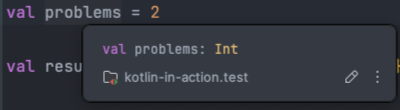

# 1. Variables, Expressions, and Types

## Summary

- 변수(Variables)
  - `var`: 재할당 가능
  - `val`: 읽기 전용
- 표현식과 문(Expressions and Statements)
  - 표현식(expression)은 값으로 평가할 수 있다.
  - 문(statement)은 값으로 평가할 수 없다.
  - 변수에 값이 할당가능한지 확인하면 표현식인지, 문인지 확인 가능하다.
- Basic Types
  - `Int`, `Double`
  - `Boolean`
  - `String`

## Quick Tip



- 변수명 위에 `F1`을 사용하면 추론한 변수의 타입을 확인할 수 있다.

## Boolean

- `Boolean`은 1800년대 조지 불의 이름을 따 명명했다.

## Type and Reassignment

```kotlin
var numberOfPizza: Int = 8
numberOfPizza = "eight"
```

> Error: Type mismatch. Required: Int. Found: String. (does not compile)

- 정적 타입(static typing)은 컴파일 시 변수의 타입이 결정된다. 실행 중에는 변경할 수 없기 때문에 코드를 다시 작성하지 않으면 타입을 변경할 수 없다.

## 참고 자료

- [Variables, Expressions, and Types](https://typealias.com/start/kotlin-variables-expressions-types/)